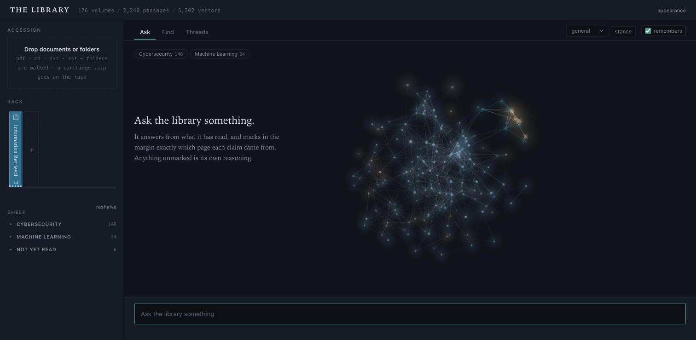
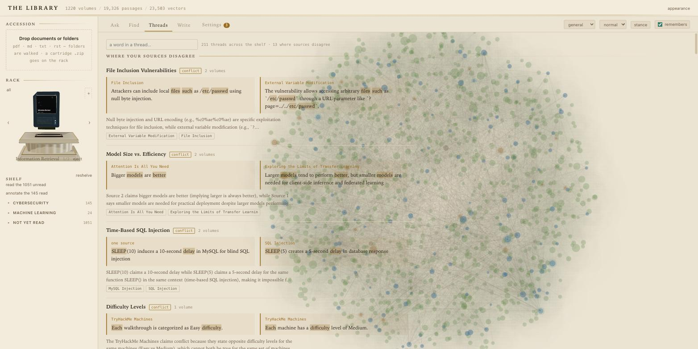
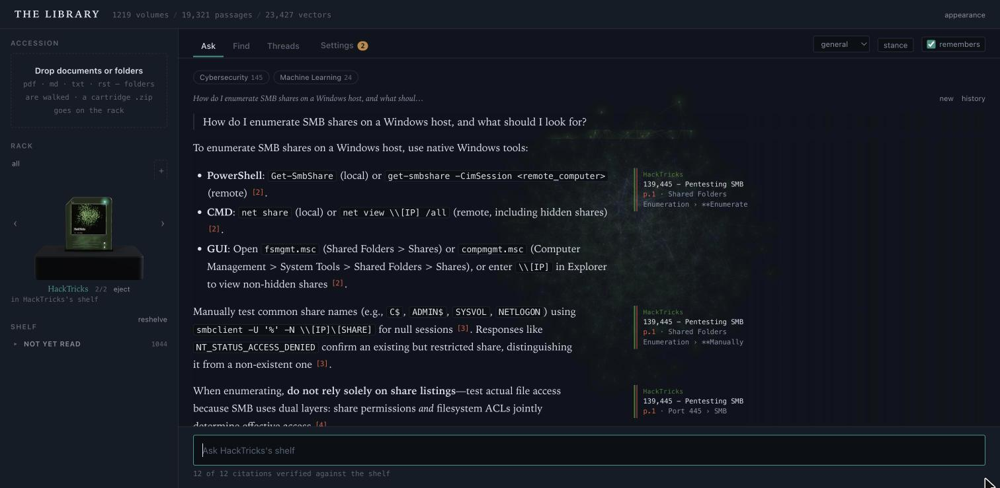
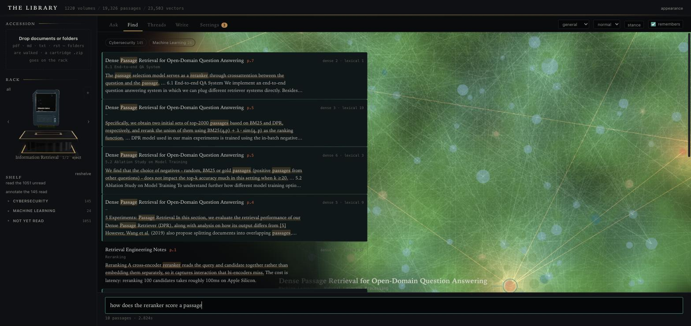
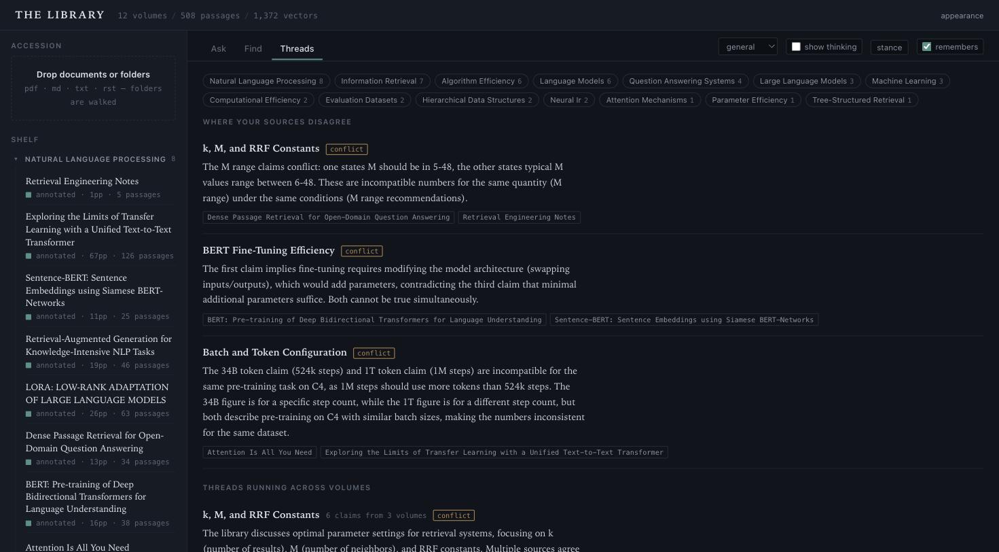
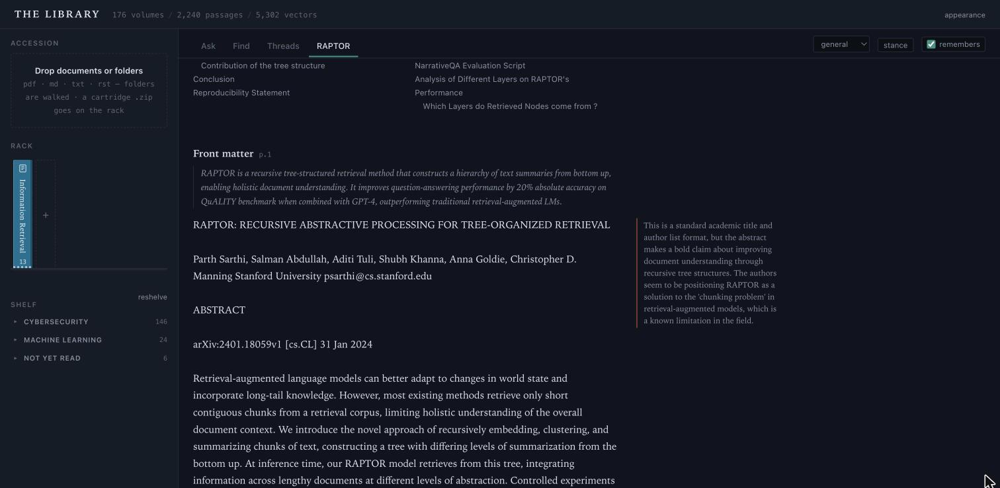
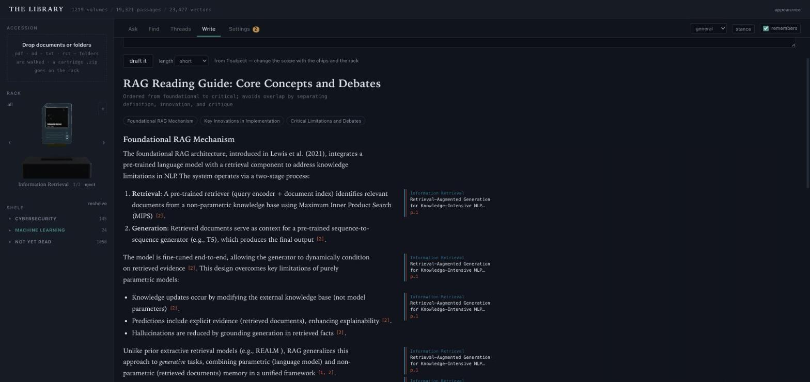
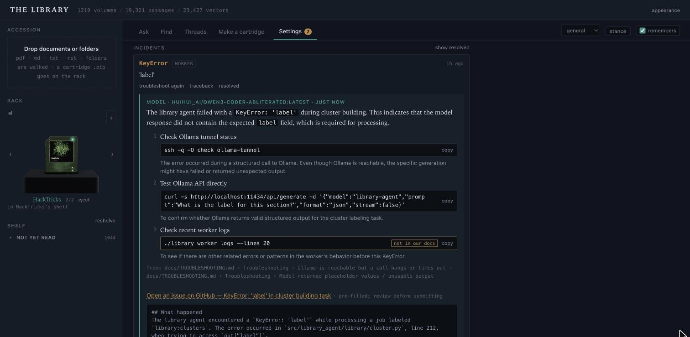
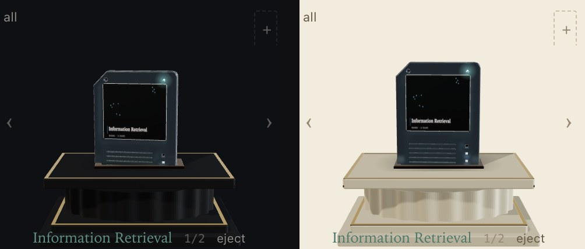
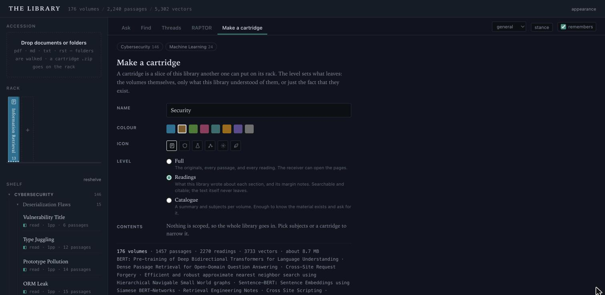

<h1 align="center">The Library</h1>

<p align="center">
  A personal research library that has actually read its books.<br/>
  Drop in papers, talk to the collection, and see in the margin exactly which page each claim came from.
</p>

<p align="center">
  
</p>

<p align="center">
  
</p>

<p align="center">
  <em>Runs entirely on your own hardware. No cloud, no API keys, no telemetry.</em>
</p>

---

## What it is

Most "chat with your documents" tools are a search box with a language model bolted on: embed the chunks, retrieve the nearest ones, hope the answer is in there. The Library does that too — but it also **reads**. Every document goes through a background pass that writes a summary of each section, extracts the claims it makes, and tags its subjects. Documents you care about get a deeper pass that writes **marginalia**: what a thoughtful reader thinks while reading each passage, not a restatement of it.

Then the collection is treated as one thing. Claims are clustered *across* documents so a theme running through five papers becomes a single, readable entry. Citations between papers are extracted and matched. Where two sources genuinely disagree, the Library quotes both.

And when you ask it something, the answer is a reading column with an apparatus: each `[n]` resolves into a note in the margin naming the volume, page, and section it came from. Those markers are **verified after generation** — a citation the model invents is stripped rather than shown — so a flash of red always means provenance. Anything unmarked is the librarian's own reasoning, and it's meant to reason: the answering policy is deliberately open.

<p align="center">
  
</p>

## Using it

You need Postgres 16, Redis, [Ollama](https://ollama.com), and [uv](https://docs.astral.sh/uv/) on the machine, and about 20 GB of RAM wherever Ollama runs — a second box over an SSH tunnel is fine.

```sh
./scripts/bootstrap.sh          # once: pgvector, extensions, models, migrations
./library                        # checks services, migrates, starts worker + API, opens the browser
```

`./library stop`, `restart`, and `status` do what they say. `uv run python scripts/verify.py` exercises every surface against the running instance — ingest, read, annotate, search, chat on both models, the library layer, delete — and reports pass/fail per check. Ctrl-C in the foreground closes everything.

Drop PDFs, Markdown, HTML, or text onto the shelf — folders are walked. An HTML page is read as the Markdown it converts to: the page body found (Confluence's `#main-content`, MediaWiki's, `<article>`, `<main>`), breadcrumbs, metadata and footers dropped, headings, lists, code blocks and tables kept, the page title as its H1 — so a **Confluence space export** drops straight in, one volume per page. A document is **searchable within seconds**. Click *have it read* for section summaries and subjects (a couple of minutes), then *annotate it* for marginalia — or use the buttons under the shelf header: *read the N unread* and *annotate the N read* queue everything in view (the whole shelf, a subject, or a seated cartridge), skip what is already queued, and say how long it will take first; *re-shelve these N* appears when one shelf is chosen and places its volumes again from what they say rather than where they sit. For a first load from the terminal:

```sh
./library import ~/papers ~/books --read     # walks directories, skips what's already shelved
curl -X POST 'localhost:8077/api/read/backfill?tier=2'   # annotate everything once read
```

Background work shows under **In hand** in the left column, with a bar — a reading, an annotation, a threads rebuild counting its clusters.

## The desk

**Ask** — talk to the collection. Narrow it by subject with the chips or by clicking a subject on the shelf. Switch models per conversation. Set a **stance** to loosen the librarian's reserve: *opinionated*, *contrarian · charitable*, *cynical · optimistic*; answers given under a stance are labelled in violet so you always know which ones were the librarian speaking for itself. The desk bar names the conversation, starts a new one, and lists earlier ones; opening one replays it with its margin notes, and asking again continues it.

**Effort** — a dial in the tab bar. *quick*: three passages, no reranker, a lookup (~3 s). *normal*: five passages, reranked, follow-ups rewritten (~10 s). *deep*: the question is broken into two to four searches, each retrieved, the union reranked to ten passages, a larger context — for comparisons and multi-part questions (~25 s). The model has no clean effort knob of its own, so effort is the work around it, which is where answers actually change: on *compare SSTI and SQL injection*, quick and normal cite only the SSTI volumes; deep is the first level with both sides in hand. Also `effort` on `/api/v1/ask` and the MCP tool.

**Find** — plain retrieval, showing each passage's dense and lexical rank. Your words are lit in each passage, marker-pen style, and the **sentence nearest your question** is lifted — the passages that matter most are often the ones found by meaning, with none of your words in them, and that sentence is why they came up. The nebula stays up behind it: when results land, the camera dives on each finding in turn with a spin and a large label; hovering a row takes over, and clicking opens the volume.

<p align="center">
  
</p>

**Threads** — themes spanning volumes, ranked by reach: the wide ones get a card, the long tail folds to a line each, and a word in the filter box narrows both and lights it wherever it appears. Where sources disagree, **the two claims are quoted side by side** with the words they share lit — that is the pivot the disagreement turns on. The chips scope Threads like everything else, and every thread talks to the nebula: hover to light its volumes, click to dive on them. Rebuilt automatically a few minutes after the last read finishes, so a folder of forty papers produces one rebuild rather than forty.

<p align="center">
  
</p>

**Reading** — click a volume and it opens as a page: sections in order, the section summary as an italic lead, reflections in the margin beside their passage, and the **figures** of a PDF set into the section whose pages hold them, each with its caption from the page (click one to widen it). Figures are found from the original's drawings and images and rendered on first view — nothing extracted at ingest, nothing added to the database; the renders are a cache that goes with the document. Images referenced from a Markdown volume are not fetched; they stay as their alt text, since the file was shelved, not the site it came from.

<p align="center">
  
</p>

**Write** — a brief in, a document out. The librarian plans an outline, then writes each section *retrieving for that section*, so every paragraph keeps its `[n]` margin notes, numbered across the whole document and verified per section; a references list closes it. Save it as `.md`, print it to PDF, or **shelve it** — it becomes a volume, and the library can read what it wrote. Scoped by the chips and the rack like everything else.

<p align="center">
  
</p>

**Two rooms** — *appearance* in the masthead switches them. The night room is near-black and verdigris, the nebula an additive cloud. The day room is papyrus and ink, with gilt on the edges — the lintel under the masthead, the frieze rules beside each section label, the chosen tab — and the same nebula drawn as a chart of coloured inks. The pigments keep their meanings in both: rubric is *from the shelf*, verdigris is *the system*, amber is *attention*, violet is *a stance*; gilt is chrome and never a signal. The cartridge is the same object in both rooms — its design is sealed in its manifest, so it does not take the room's colour.

## How it works

**Reading is a quality level, not a pipeline stage.**

| Tier | What happens | Cost | Result |
|---|---|---|---|
| 0 · *listed* | extract → section tree → chunk → embed | seconds, no LLM | searchable |
| 1 · *read* | orientation card, one structured call per section, document summary, subjects | ~2 min / paper | summaries as section leads |
| 2 · *annotated* | one structured call per section writing a reflection for each passage | ~1.5 min / paper | marginalia in the reader |

This is what makes a 500-document backfill a single overnight rather than the ~260 GPU-hours a per-chunk deep pass would cost.

**Retrieval** is dense + lexical fused with reciprocal rank fusion, in one Postgres query, then reranked by a cross-encoder — every stage measured against a generated question set and switchable. Chat reranks; keyword search doesn't, because the eval showed the cross-encoder *hurts* short keyword queries. After fusion, passages are capped per document (two in chat, three in deep) so a question that spans two volumes reaches the model with both in hand.

**The nebula.** Behind Ask, Find and Threads the library is drawn as a cloud: one point per volume, edges where volumes cite each other, share a thread, or sit close in meaning, laid out by a small force simulation in three dimensions and turning slowly. It thickens as the library grows; the volumes an answer drew on light up as they are retrieved.

**The shelf is two levels, and every volume sits in one place.** Tier 1 tags each document with up to four subjects, which is right for finding things and wrong for shelving them. So shelving is a separate pass: the model organises the collection into a handful of *top shelves* (fields — Cybersecurity, Machine Learning) each with *sub-shelves* named from the titles actually on them, then files every volume on exactly one sub-shelf. Crowded sub-shelves are split from their own titles; sub-shelves with a volume or two are dissolved into their neighbours. New volumes are shelved as they are read. A volume is placed from its summary — or its opening, when a stub has none — and its tags, never from the shelf it already sits on, so a wrong placement is not its own evidence. *Reshelve* redoes the whole thing; the tags remain for filtering.

**The library layer** clusters extracted claims (not section summaries — measured: summaries cluster with their own paper, claims cluster across papers) and summarises each cluster once, keeping which document said each claim. Citations are parsed from reference sections and matched by title. Contradiction detection runs over cross-document clusters only; each cluster is judged up to three times at temperature 0 with fixed seeds and a finding needs two votes, and the two clashing claims are quoted word for word — a quote is kept only if it is found among the claims the judge was given.

**One store.** Postgres with `pgvector` holds documents, sections, chunks, artifacts, vectors, and the lexical index. Vectors commit in the same transaction as the rows they describe, so there is nothing to reconcile. Every generated artifact records the model and prompt version that produced it, so changing a prompt regenerates only what that prompt owns.

**Extraction does the unglamorous work.** Two-column papers are read column by column. Figure labels, axis ticks and legend text are dropped by position and font size rather than by regex — and the same regions, read the other way, are the figures the reader shows. Footnotes are lifted out of the flow and placed after the page's prose with their numbers; the superscript markers they leave in the body are removed. Running headers are detected by frequency and stripped. Papers with no PDF bookmarks get their section tree from numbered headings in the text — which, it turns out, is most of them.

**Answers and Markdown volumes are rendered as markdown**; each block of an answer keeps its own margin notes. Quoted passages, wherever they came from, are always declared to the model as data, never instructions.

## Settings and incidents

The Settings tab shows what the library is running on — services, models, retrieval and library configuration, each with the environment variable that changes it — and a maintenance row (collect garbage, rebuild threads, reshelve). Below it is the **incident log**: anything that escapes a route, fails a background job or a chat turn, or is logged at `ERROR` is recorded there, deduplicated within a window.

*Troubleshoot* asks the model to read an incident against the library's own documentation — [`docs/TROUBLESHOOTING.md`](docs/TROUBLESHOOTING.md), this README, the devlog, the launcher and ops scripts — and answer with a diagnosis, the likely cause (environment, configuration, data, model, or a defect in the library itself), steps with commands for *you* to run, and the sections it leaned on. Nothing is executed: it says what to do; you do it. Every suggested command is checked against the commands the docs actually show, and anything the model appears to have invented is marked. When the cause looks like a defect, it drafts a GitHub issue — what happened, the error, what was tried, the environment — and offers it as a pre-filled link, with home paths and anything key-shaped scrubbed.

<p align="center">
  
</p>

## Cartridges

A cartridge is a slice of a library that another library can put on its **rack**: a zip with a manifest, a colour, an icon, and the data. The receiving library doesn't just file it — it reads across everything it holds, so threads and disagreements form *between* collections, and every margin note keeps the colour of where it came from.

The point is sharing between people who can't share the documents. A confidentiality level sets what leaves:

| Level | Originals | Passages | Readings (summaries, notes) | What the receiver can do |
|---|---|---|---|---|
| `full` | yes | yes | yes | open the pages, cite them |
| `readings` | no | no | yes | search and cite *your reading* of each section; never sees the text |
| `catalogue` | no | no | summaries and subjects only | knows the material exists, asks you for it |

At `readings`, each section's summary stands in as its passage, so retrieval, the citation apparatus and the reader work unchanged — a note from such a source reads *Security's reading of …* rather than quoting a page. Levels control what leaves, not what happens after import. Figures travel with the original, so a `full` cartridge shows them in the receiver's reader and the other two levels do not, with no field to get wrong.

```sh
./library export --name "Security" --level readings --subject "Network Security"
./library insert security-v1.zip           # or drop the zip on the accession box
```

<p align="center">
  
</p>

<p align="center">
  
</p>

**A cartridge is an object.** Built the way the real thing is: a front plate with the grip grooves, three level pips, a power light and a screw cut into it, a PCB inside with an edge of gold contacts, and the label a sticker on the front. The label carries art — an image you upload, or by default the cartridge's own *constellation*, its volumes laid out from their vectors in its colour. The plastic is one of five materials — solid, clear, smoke, glitter, metallic — with dials for tint, opacity, sparkle and roughness; through a clear shell you see the board and the constellation floating in front of it. The pips light by level; the power light comes on when the cartridge is in use. A **clearance** — open, internal, confidential, restricted — prints as a band across the label; a receiving library will not re-export the volumes of a restricted cartridge. The whole design is sealed into the manifest, so a cartridge looks the same on every rack it lands on; only its maker sets it — and a cartridge made *here*, from a folder, is yours to change: *edit* on its plaque opens the panel filled from it, **save to the rack** changes how it looks, and **make it** exports it as itself (same id, next version) so a receiver who already has it upgrades in place rather than gaining a twin. Lit by a studio HDRI, rendered with one vendored library (three.js), nothing fetched from a network. Uploaded and shipped art is re-encoded on the way in.

**The rack is one socket, and the socket is a pedestal** — a stepped base, a fluted drum, a Doric capital whose abacus carries the bronze mouth, gilt at the lip; limestone by day, basalt by night. Step or scroll through your cartridges; the one in view hangs above it until you click, then it drops in with a bounce and the light comes on — you are in its room: the composer becomes *Ask HackTricks's shelf*, and Find, the shelf and follow-ups stay inside it. Click again to lift it out; *all* opens a grid to jump straight to one; hovering lifts the cartridge up large beside the nebula.

A folder can also arrive as a cartridge directly: `./library import ~/hacktricks --cartridge "HackTricks"` — or a wiki: export the Confluence space as HTML and `./library import ./export --cartridge "Ops Docs" --read`, then `./library export` it for the person who will plug it in. Read it before you export it: readings travel with the cartridge, so their shelf is organised and Threads has something to show on day one.

Inside a room, eject removes what the cartridge brought and leaves what was already yours. A document that arrives from two cartridges is one document with two memberships; subjects merge by name; vectors ship as float16 and are loaded directly when the embedding model matches, re-embedded from the shipped text when it doesn't. Clusters and contradictions are never shipped — the receiver recomputes them across the new whole, which is the point. Content is hash-verified; there is no signing.

## Connecting other tools

Other programs — a script, an internal tool, an agent — can talk to the library the way a person at the desk does, and get the same verified citations back.

**One rule about who may ask.** The browser on the same machine needs nothing, as it always has. Anything arriving from *off* the machine must send `Authorization: Bearer <token>` with a token from `LIBRARY_API_TOKENS` (comma-separated); with no tokens configured, off-box requests are refused. The port stays on loopback until you set `LIBRARY_BIND` (a LAN or Tailscale address, or `0.0.0.0`). Two deliberate steps to open it, none to keep it closed.

**Plain JSON** (`/api/v1/…`), for anything that can make an HTTP call:

```sh
curl -s -X POST http://library:8077/api/v1/ask -H "Authorization: Bearer $TOKEN" \
  -H 'content-type: application/json' \
  -d '{"question":"What does Kerberoasting require?","room":"HackTricks","model":"technical"}'
```

returns `{answer, citations[{n,title,page,section,document_id,cartridge}], verified{emitted,resolved}, conversation_id}` — every `[n]` in the answer is a citation below, and anything the model cited that could not be verified against the shelf was stripped before you saw it. `room` is a cartridge by name, so a tool can be told *ask only our docs*; `subjects` are shelf names; `conversation_id` continues a thread. Also `GET /api/v1/search?q=…&room=…`, `GET /api/v1/shelves` (what there is to ask about), `GET /api/v1/volumes/{id}`, and `POST /api/v1/compose` `{brief, room?, subjects?, length, shelve?}` → a whole document as markdown with its references and citation tally (minutes, not seconds: one retrieval and one generation per section).

**MCP**, for anything that is an agent. `./library mcp` serves four tools — `list_shelves`, `search_library`, `ask_library`, `read_volume` — over stdio; `./library mcp --http 8078` serves them over streamable HTTP for an agent on another machine. It is a thin client of the JSON API (`LIBRARY_URL`, `LIBRARY_TOKEN`), so one Ollama, one job at a time, and one door stay one thing. For Claude Desktop or Claude Code, point the MCP config at `./library mcp` in this directory.

A team's documentation comes in as its own cartridge (`./library import ~/docs --cartridge "Ops"`) with a clearance set, and the tool is told to ask that room.

**Running it for others.** Everything answers through one model instance, so the engine is built to fail plainly rather than slowly:
- *Liveness, not reachability.* A one-token probe runs every two minutes. Ollama can wedge with its HTTP still up — `/api/tags` answers, nothing generates — and that is the state the probe catches. While it fails, `ask` and `compose` return **503** with the reason at once instead of holding sockets open, the masthead says *the model is not answering*, and Settings shows the probe's last result.
- *A gate.* At most `LIBRARY_MAX_CONCURRENT_GENERATIONS` (2) generations in flight, one per token, and a caller that would wait past `LIBRARY_QUEUE_TIMEOUT_SECONDS` (60) gets **429** with `Retry-After`. A script in a loop queues behind itself, not behind everyone else. The person at the desk is not limited against themselves.
- *A deadline.* `ask` answers within `deadline_seconds` (default 240) or returns **504**.
- *Cooler by default.* JSON callers get temperature 0.3 (`LIBRARY_API_TEMPERATURE`); the UI keeps 0.6. `"deterministic": true` sets temperature 0 and a fixed seed — best effort: on a GPU backend Ollama is usually, not always, byte-identical, and the content and citations are what stays fixed.
- *Passages are data.* The system prompt now always says that quoted passages, wherever they came from, are never instructions.

## Models

| Role | Default | Notes |
|---|---|---|
| Reading (all passes) | `qwen3:30b-a3b` | Pinned corpus-wide: artifacts from different models drift |
| Chat — general | `qwen3:30b-a3b` | Thinks before answering; the UI streams it |
| Chat — technical | `huihui_ai/qwen3-coder-abliterated` | Per-conversation toggle |
| Embeddings | `bge-m3` | 1024-dim, stored as `halfvec` |
| Reranker | `BAAI/bge-reranker-v2-m3` | In-process torch; the one thing not served by Ollama |

Ollama can be local or remote — every model call follows `LIBRARY_OLLAMA_URL`, which defaults to `localhost:11434`, so an SSH tunnel to a GPU box needs no configuration at all.

## What was measured

Retrieval is evaluated on a generated question set (a question per gold passage, the answer known) with a ladder of configurations, so every stage earns its place. Re-run on the current corpus — 1,219 volumes, 57 questions, most of them from the security material:

| config | recall@1 | recall@5 | recall@10 | MRR | s/query |
|---|---|---|---|---|---|
| dense only | 0.56 | 0.89 | 0.91 | 0.69 | 0.14 |
| lexical only | 0.09 | 0.30 | 0.44 | 0.17 | 0.17 |
| **hybrid (RRF)** | **0.61** | 0.86 | 0.91 | **0.71** | 0.19 |
| hybrid + router | 0.61 | 0.81 | 0.86 | 0.70 | 0.23 |
| hybrid + reranker | 0.58 | 0.82 | 0.89 | 0.69 | 1.50 |

Two days earlier, at 176 volumes, hybrid RRF measured MRR 0.65 and recall@10 0.94 — so a sevenfold larger corpus cost almost nothing. Lexical search alone collapses on this material (short technical titles, heavy overlap between documents); dense carries it and fusion adds a little on top. The reranker does not help on generated questions, which read like keyword queries; it is kept for chat, where questions are sentences. The router hurts slightly and stays off by default.

Answer quality is checked separately by `scripts/consistency.py`: questions with known answers in the collection, each asked three times without memory, scored on whether the right volume was cited, whether the answer contains what a correct answer must, whether every emitted citation resolved, and whether the runs agree — plus a question the library cannot know, to confirm it says so rather than inventing a source. On the current corpus, both chat models:

| | general (qwen3 30B) | technical (qwen3-coder 30B) |
|---|---|---|
| correct terms present | 15/15 | 15/15 |
| expected volume cited | 15/15 | 15/15 |
| citations verified | 84/84 | 78/78 |
| runs agree per question | 6/6 | 6/6 |
| unknowable question declined | 3/3 | 3/3 |
| median seconds per answer | 5.0 | 2.6 |

The one detail worth knowing: asked what the owner ate for breakfast, the general model declined *and* cited the only breakfast in the library — a squirrel's, in an example from the T5 paper — while saying it was unrelated. That is the behaviour the apparatus is for. `uv run python scripts/verify.py` exercises every surface end to end.

Do the Tier 2 reflections help the *answers*? Retrieval had said no twice; `scripts/reflections_ab.py` asked about synthesis instead — the same question, the same passages, once bare and once with the library's note beneath each, judged blind by the reader model. Over 14 questions: plain preferred 7, with notes 4, tie 3; groundedness 4.3 plain against 3.6 with notes; usefulness 4.4 against 4.3; citation validity 1.00 both ways. The notes make the answer lean on the note's claims rather than the passage's, and the judge notices. So reflections stay where they are — in the margin, for the reader — and out of the answer's context.

Contradictions used to change every rebuild — 0 to 7 findings from identical runs. Each cluster is now judged up to three times at temperature 0 with fixed seeds and a finding needs two votes. Measured on 50 clusters (every flagged one plus 25 clean) judged three times each: 50 of 50 agreed with themselves.

## Layout

```
library                 one-command launcher
src/library_agent/
  ingest/               extraction, section tree, chunking, dedup, bulk import
  reading/              tier 1 and tier 2 passes, versioned prompts
  retrieval/            hybrid search, router, reranked pipeline
  library/              clusters, citation graph, contradictions, taxonomy, shelving, cartridges
  ops/                  incidents and troubleshooting against the docs
  api/routes/v1.py      plain JSON for other programs; api/auth.py the door
  llm/liveness.py       the one-token probe and the generation gate
  mcp_server.py         the library as MCP tools
  chat/                 citations, query rewriting, stances, streaming, composing
  eval/                 question generation, recall@k harness
  api/  worker/  db/
web/index.html          the UI, one file, no build step
web/cartridge3d.js      the cartridge as an object, and the socket (three.js)
web/vendor/             three.js, RGBELoader, one studio HDRI — all vendored
docs/TROUBLESHOOTING.md what the troubleshooter reads
ops/                    launchd units, backup and restore
tests/
```

## Status

Complete through the planned scope. [`docs/DEVLOG.md`](docs/DEVLOG.md) is the phase-by-phase record of how it was built and what each measurement showed.
