<h1 align="center">The Library</h1>

<p align="center">
  <b>A personal research library that has actually read its books.</b><br/>
  Drop in papers, books, runbooks or a wiki export. Ask the collection anything,<br/>and see in the margin exactly which page each claim came from.
</p>

<p align="center">
  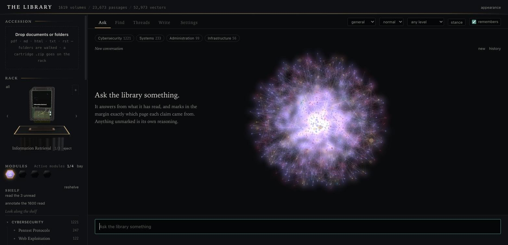
</p>

<p align="center">
  <em>Runs entirely on your own hardware. No cloud, no API keys, no telemetry.</em><br/>
  <a href="https://halicea7.github.io/TheLibrary/"><b>See it work →</b></a> — the interface over placeholder material, with a guided walk through how each part works. Nothing runs there; it is the shape of the thing.
</p>

<p align="center">
  <a href="#getting-started">Getting started</a> ·
  <a href="#the-desk">The desk</a> ·
  <a href="#how-it-works">How it works</a> ·
  <a href="#cartridges">Cartridges</a> ·
  <a href="#classification">Classification</a> ·
  <a href="#modules">Modules</a> ·
  <a href="#connecting-other-tools">API &amp; MCP</a> ·
  <a href="#what-was-measured">Measurements</a>
</p>

---

**What's inside**

- **It reads.** Every volume gets section summaries, claims and subjects in the background; the ones you care about get marginalia — what a thoughtful reader thinks beside each passage.
- **It cites, and checks.** Every `[n]` in an answer is a note in the margin naming volume, page and section, verified after generation. An invented citation is stripped, never shown.
- **It connects.** Claims are clustered across volumes into *threads*, and where two sources genuinely disagree it quotes both, side by side.
- **Ask, Find, Threads, Write.** Answer a question, find a passage, browse what the collection agrees and argues about, or compose a whole cited document — up to a thesis in chapters.
- **Cartridges.** Share a slice of your library with another one — the text, only your reading of it, or just a catalogue — and threads form *between* collections.
- **Classification.** Levels on volumes and passages, ceilings on what a question, a remote model or an export may touch, and every answer portion-marked.
- **Modules.** Read-only live connectors (SentinelOne, any HTTP API, any MCP server) consulted mid-question, their results cited beside the passages.
- **Two rooms.** A night room and a day room, with the library drawn behind every view as a nebula of its volumes.

<p align="center">
  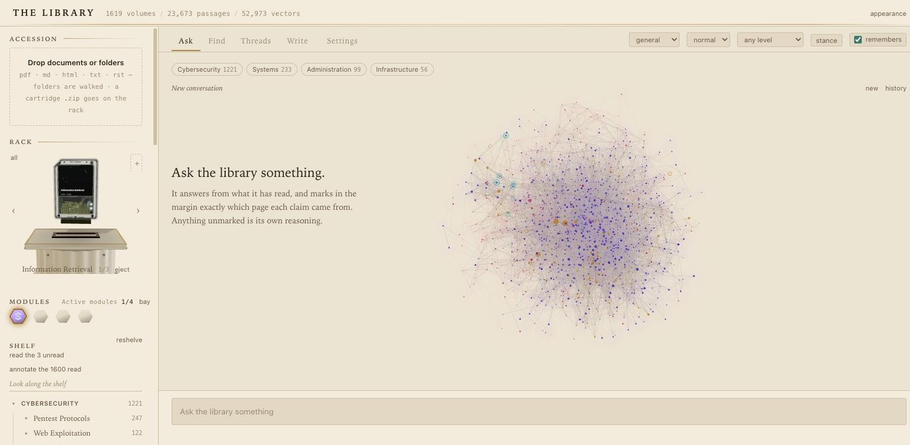
</p>

---

## Getting started

Runs on macOS or Linux, entirely on your own hardware. You need four things installed:

- **[Postgres 16](https://www.postgresql.org/)** with the `pgvector` and `pg_trgm` extensions (bootstrap builds pgvector for you)
- **[Redis](https://redis.io/)** — the background-job queue
- **[Ollama](https://ollama.com)** — the models run here; local, or on another box over an SSH tunnel
- **[uv](https://docs.astral.sh/uv/)** — the Python runner

Plus about **20 GB of RAM wherever Ollama runs**. On a Mac: `brew install postgresql@16 redis uv ollama` and `brew services start postgresql@16 redis`.

**1. Pull the models.** Two are required; two are optional but recommended.

```sh
ollama pull qwen3:30b-a3b bge-m3                                  # required: reader/chat, embeddings
ollama pull qwen2.5vl huihui_ai/qwen3-coder-abliterated          # optional: figures + OCR, technical chat
```

If Ollama runs on another machine, forward it and point the library at it — no other config needed:

```sh
ssh -N -L 11434:localhost:11434 you@gpu-box &   # tunnel; or set LIBRARY_OLLAMA_URL=http://host:11434
```

**2. Set it up, once.** From the repo root:

```sh
./scripts/bootstrap.sh     # builds pgvector, creates the database + extensions, runs migrations
```

**3. Start it.**

```sh
./library                  # checks services, migrates, starts the worker + API, opens the browser
```

It opens at `http://localhost:8077`. `./library stop`, `restart` and `status` do what they say; Ctrl-C closes everything.

**4. Use it.** Drop a PDF (or Markdown, HTML, text) onto the shelf. It's **searchable within seconds**; click *have it read* for summaries and subjects, then *annotate it* for marginalia. Ask a question in the **Ask** tab — every claim from the shelf carries a citation you can check. The first visit is walked by a short tour of the room.

**Or run it in Docker.** Postgres (with pgvector), Redis, the API and the worker come up together; Ollama stays wherever your GPU is.

```sh
docker compose up -d                  # then open http://localhost:8077
docker compose logs -f api worker
docker compose run --rm api ./library import /import --read     # files placed in ./import
```

- **Models** are reached at `LIBRARY_OLLAMA_URL`, by default Ollama on the host (`host.docker.internal:11434`). For Ollama inside compose too: `docker compose --profile ollama up -d` with `LIBRARY_OLLAMA_URL=http://ollama:11434` in `.env` (uncomment the GPU block for an NVIDIA card).
- **Everything the library keeps** — the database, and `~/.library-agent` (originals, figures, cartridges, providers, modules, classification) — lives in named volumes, so `docker compose down` and a rebuild keep it. `down -v` deletes it.
- **The port is published on this machine's loopback only**, and the API trusts exactly the compose network's gateway as "this machine" (`LIBRARY_TRUSTED_NETWORKS`), so the door is as closed as outside a container. To open it to other machines, set `LIBRARY_API_TOKENS` and publish the port more widely — two deliberate steps, as always.
- **The reranker** (CPU torch) is in the image; `WITH_RERANKER=0 docker compose build` leaves it out and saves about a gigabyte, at the cost of unreranked Find and Ask.
- Any `./library` command runs in the container: `docker compose run --rm api ./library bench init`.

To check everything works end to end: `uv run python scripts/verify.py` exercises every surface against the running instance and reports pass/fail per check.

Nothing leaves your machine: no cloud, no API keys, no telemetry. Other models are opt-in under **Settings** ([Models](#models)); live connectors in the **bay** under the rack ([Modules](#modules)).

---

## What it is

Most "chat with your documents" tools are a search box with a language model bolted on: embed the chunks, retrieve the nearest ones, hope the answer is in there. The Library does that too — but it also **reads**. Every document goes through a background pass that writes a summary of each section, extracts the claims it makes, and tags its subjects. Documents you care about get a deeper pass that writes **marginalia**: what a thoughtful reader thinks while reading each passage, not a restatement of it.

Then the collection is treated as one thing. Claims are clustered *across* documents so a theme running through five papers becomes a single, readable entry. Citations between papers are extracted and matched. Where two sources genuinely disagree, the Library quotes both.

And when you ask it something, the answer is a reading column with an apparatus: each `[n]` resolves into a note in the margin naming the volume, page, and section it came from. Those markers are **verified after generation** — a citation the model invents is stripped rather than shown — so a flash of red always means provenance. Anything unmarked is the librarian's own reasoning, and it's meant to reason: the answering policy is deliberately open.

<p align="center">
  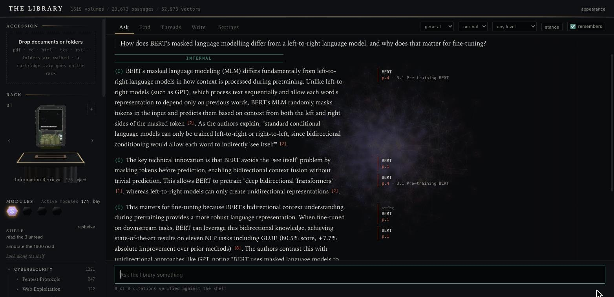
</p>

## Using it

Drop PDFs, Markdown, HTML, or text onto the shelf — folders are walked. A document is **searchable within seconds**.

- **Wikis drop straight in.** An HTML page is read as the Markdown it converts to: the page body found (Confluence's `#main-content`, MediaWiki's, `<article>`, `<main>`), breadcrumbs, metadata and footers dropped, headings, lists, code and tables kept, the page title as its H1. A **Confluence space export** becomes one volume per page, and each page keeps who created and last updated it, so *what has Hector written?* can be answered (`./library authors` adds this to pages shelved before it existed).
- **Reading is a click.** *have it read* writes section summaries and subjects (a couple of minutes); *annotate it* writes marginalia. Under the shelf header, *read the N unread* and *annotate the N read* queue everything in view — the whole shelf, a subject, or a seated cartridge — skip what's already queued, and say how long it will take first.
- **Re-shelving.** *re-shelve these N* appears when one shelf is chosen, and places its volumes again from what they say rather than where they sit.

For a first load from the terminal:

```sh
./library import ~/papers ~/books --read     # walks directories, skips what's already shelved
curl -X POST 'localhost:8077/api/read/backfill?tier=2'   # annotate everything once read
```

**Look along the shelf** — the line under the shelf header filters it as you type: every word must begin a word in a volume's title, its shelf, or its cartridge, so *psych tac* finds the Psychological Tactics shelf. Matching shelves open, your words are lit, Enter opens the first volume, Escape clears. It reads names only; when nothing matches it offers to *look inside the passages*, which is Find.

**Books read as books.** A PDF bookmarked by chapter only would hand the reader 40–60k-character sections, of which Tier 1 reads a fraction. So any section over ~9k characters is cut into parts of about one read at paragraph boundaries (*Chapter 3 (cont. 2)*), and a long document's summary is written from a digest of each stretch rather than from its opening chapters. A 700-page book reads fully — both tiers — in under twenty minutes.

**Background work** shows under **In hand** in the left column, with a bar — a reading, an annotation, a threads rebuild counting its clusters — and a **pause**: the piece in progress finishes, nothing new starts until you resume, and the queue keeps its order. Chat is never paused; it already has priority over reading.

**The first visit is walked.** A tour lights one part of the room at a time — the drop zone, the read and annotate buttons, *reshelve*, the rack, each tab, effort, stance, the two rooms — with a card saying what it's for and everything else dimmed. Esc or *skip* ends it; *show the tour* in Settings brings it back.

**The hosted demo** is this same `web/` directory served from GitHub Pages: on a `github.io` host (or with `?demo` locally) the page loads `web/demo.js` first, a stand-in for the server that answers every call with placeholder material and runs a longer tour. It's always the current UI.

## The desk

**Ask** — talk to the collection. Narrow it by subject with the chips or by clicking a subject on the shelf. Switch models per conversation. Set a **stance** to loosen the librarian's reserve: *opinionated*, *contrarian · charitable*, *cynical · optimistic*; answers given under a stance are labelled in violet so you always know which ones were the librarian speaking for itself. The desk bar names the conversation, starts a new one, and lists earlier ones; opening one replays it with its margin notes, and asking again continues it.

An answer draws on two kinds of source. **Passages** are the exact words of a page. **Readings** are the library's own Tier 1 summary of a section — denser than a passage, and the only way a whole book fits in front of the model at once — retrieved beside the passages, cited the same way, and marked *reading* in the margin. A question that **names a volume** by title lifts the per-document cap for that volume, so its subject is not cut to a few passages among many. In Settings, an **About you** note — who the library is for, in your words — is read into every answer's system prompt, setting the register and what can be assumed; it is not a passage and never cited.

**Effort** — a dial in the tab bar. *quick*: three passages, no reranker, a lookup (~3 s). *normal*: five passages and four section readings, reranked, follow-ups rewritten (~10 s). *deep*: the question is broken into two to four searches, each retrieved, the union reranked to sixteen passages beside eight readings, a larger context — for comparisons, multi-part questions, and "what does this work say across its chapters" (~25 s). The model has no clean effort knob of its own, so effort is the work around it, which is where answers actually change: on *compare SSTI and SQL injection*, quick and normal cite only the SSTI volumes; deep is the first level with both sides in hand. Deep answers are then **reviewed** against the passages they were given, the same audit Write runs on each section: a sentence that adopts a paper's case for its own design as fact (*Raft is simpler, so its tail latency is more predictable*), drops a benchmark's conditions, or chains passages into a mechanism none of them states comes back flagged in amber under the answer, and the flags are kept with the conversation. Also `effort` on `/api/v1/ask` and the MCP tool.

**Find** — passages, reranked by the cross-encoder (the top 20, at most three per volume), each with its dense and lexical rank. On 38 questions from real use it puts the right passage first 74% of the time, against 58% unreranked.

- **Rare names found.** A word your question uses that the library writes as a name and holds in only a few passages — a person, a project, a host — is looked up exactly when search alone misses it, and so is a volume's author. Ask and Write do the same. (Measured: six questions about people whose names sat in 9–14 passages each had found none of them; now 3–4 of the top ten mention the person.)
- **Exact names first.** A query that names something exactly — `O_DIRECT`, `--no-verify`, `RFC 7231`, `SSTable`, a `"quoted phrase"`, or a single word — is also looked up literally, and passages holding every such term come first, marked *exact*.
- **Why it came up.** Your words are lit in each passage, marker-pen style, and the **sentence nearest your question** is lifted — the passages that matter most are often found by meaning, with none of your words in them. When that sentence shares none of your words it's labelled *related excerpt*: a lead, not proof.
- **Hold.** **hold** on a hit keeps that passage in hand: the next answer starts from what you hold and retrieval fills the rest of its budget around it, and those margin notes say *held*, so an answer shows which evidence was yours and which the library found. Whole volumes can be held too — **hold** on a shelf row — and then the answer reads only the volumes in hand. The tray under the composer lists what's held; follow-ups keep it until you let go.
- **The nebula follows.** When results land, the camera dives on each finding in turn with a spin and a large label; hovering a row takes over, and clicking opens the volume.

<p align="center">
  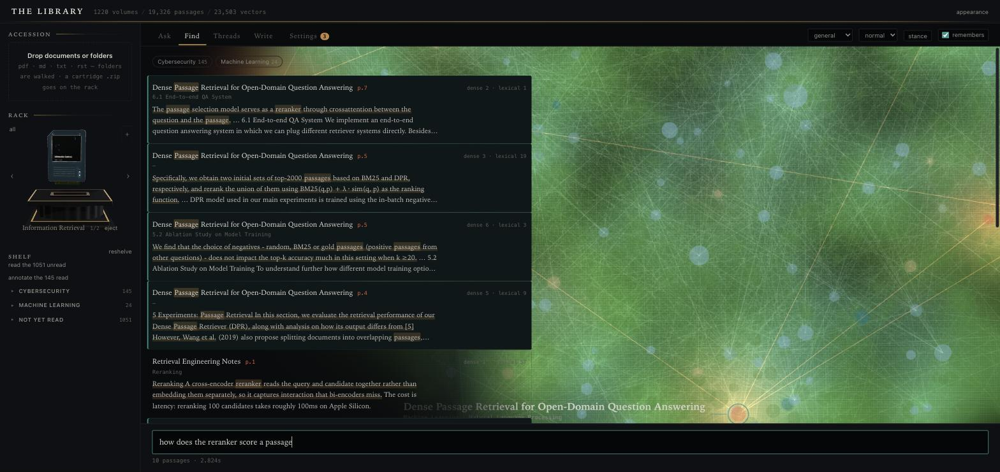
</p>

**Threads** — themes spanning volumes, ranked by reach: the wide ones get a card, the long tail folds to a line each, and a word in the filter box narrows both and lights it wherever it appears.

- **Disagreements.** Where sources disagree, **the two claims are quoted side by side** with the words they share lit — the pivot the disagreement turns on. **hold both** puts the passage behind each claim in hand, opened from what the library stored rather than searched for again; then ask which is right for your setup.
- **Scoped honestly.** A thread keeps its membership claim by claim, so inside a scope it shows only what its in-scope volumes claim ("2 of its 3 volumes are in scope"); one with fewer than two in scope isn't shown, and a disagreement appears only when both sides are. Write uses the same rule.
- **Rebuilt on its own**, never by opening the tab: once, ten minutes after the last read of a batch, or when a cartridge is inserted or ejected — so a folder of forty papers is one rebuild, not forty. It's incremental: a theme whose claims haven't changed keeps its entry and its verdict.
- Hover a thread to light its volumes in the nebula; click to dive on them.

<p align="center">
  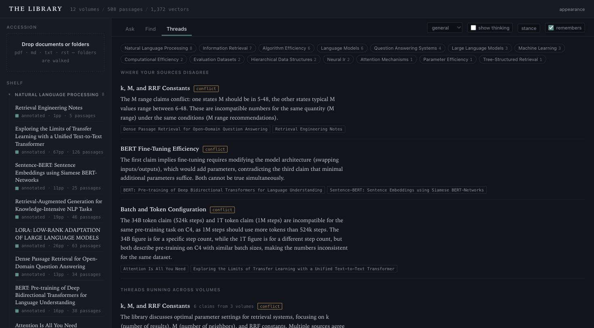
</p>

**Reading** — click a volume and it opens as a page: sections in order, the section summary as an italic lead, reflections in the margin beside their passage, and the **figures** of a PDF set into the section whose pages hold them, each with its caption from the page (click one to widen it). Figures are found from the original's drawings and images and rendered on first view — nothing extracted at ingest; the renders are a cache that goes with the document. At Tier 1 a **vision model** (`qwen2.5vl`) reads each figure with its caption and writes what it sees as a passage of its own — so Find lights it, Ask cites it by page (*as Figure 3 shows [2]*), and it travels in a cartridge; the reader shows that reading under the figure, set apart from the page's own caption. `POST /api/read/figures` queues the pass for PDFs read before it existed; `LIBRARY_VISION_MODEL=` empty turns it off. Images referenced from a Markdown volume are not fetched; they stay as their alt text, since the file was shelved, not the site it came from.

<p align="center">
  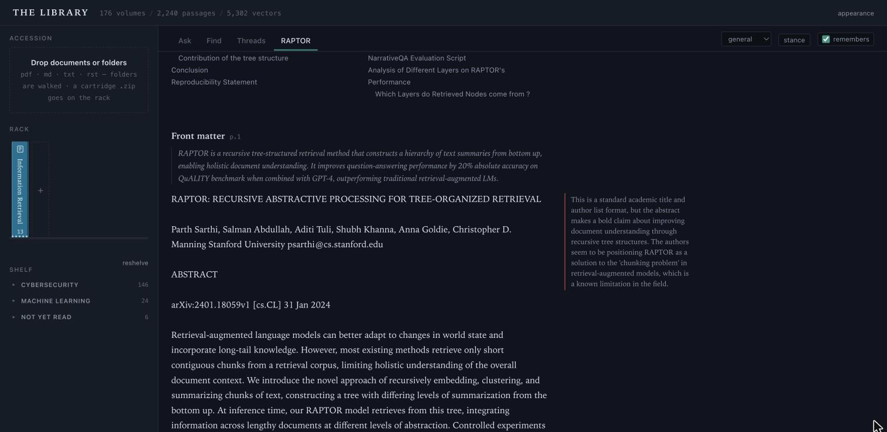
</p>

**Write** — a brief in, a document out.

1. **The brief's parts.** It's split into the parts it can't be answered without — each thing it names, compares or asks to be evaluated — and the plan must develop every part under its own name, so a brief on *Raft vs Paxos* can't quietly become one on EPaxos.
2. **Threads first.** Before outlining, the librarian pulls the threads nearest the brief, with the disagreements judged among them, and builds the sections on those; a *woven from N threads* line says what went in.
3. **Each section researched like a deep Ask.** The section's need is split into several searches, the union cut to sixteen passages beside eight of the library's readings (favouring a volume the brief names; index and bibliography pages never count as evidence). Every paragraph keeps its `[n]` margin notes, numbered across the whole document and verified per section.
4. **Reviewed.** Each section is read back against its own passages, and claims that reach past them are flagged in amber.

A long document holds its argument rather than drifting: when a section finishes, a structured call distils **what it established** — one claim, not a summary — and that running ledger is fed into every later section, which is told to build on it rather than repeat it. The **thesis** length plans in two levels, chapters each with sections, and the ledger works at both: a through-line per closed chapter plus the sections of the one in progress. Every composition is stamped with a **uuid** and closed by a **seal** — a small nebula of exactly what it drew on, one star per cited volume, coloured by provenance, lines where two were used together — ringed like a wax stamp with its id and date.

Save it as `.md` (the seal travels as inline SVG), print it to PDF, or **shelve it** — it becomes a volume, clean of the seal, and the library can read what it wrote. Scoped by the chips and the rack like everything else. Write runs on its own model role (see Models), so a larger, slower model can compose while chat stays fast. Every step is timed: under each section, a faint line says where its minutes went (write, review, takeaway …), the finished document shows totals, and each run is appended to `compositions/timings.jsonl`.

<p align="center">
  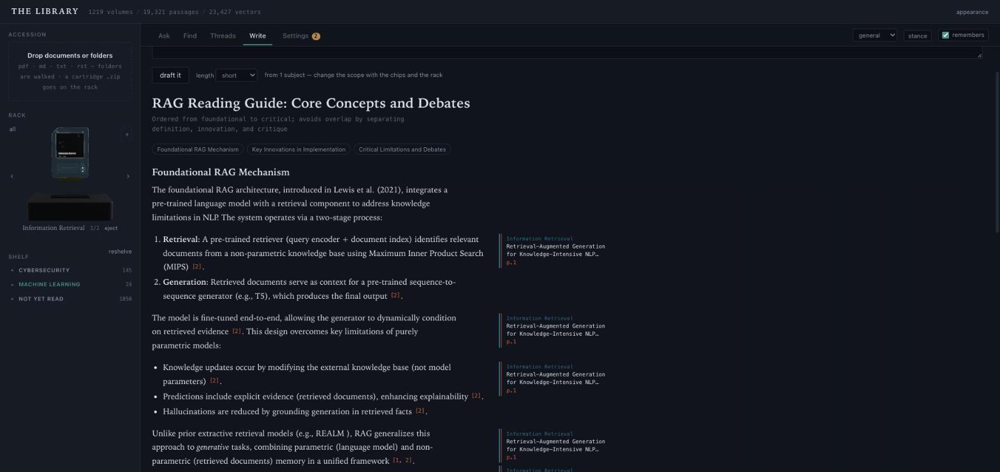
</p>

**Two rooms** — *appearance* in the masthead switches them. The night room is near-black and verdigris, the nebula an additive cloud. The day room is papyrus and ink, with gilt on the edges — the lintel under the masthead, the frieze rules beside each section label, the chosen tab — and the same nebula drawn as a chart of coloured inks. The pigments keep their meanings in both: rubric is *from the shelf*, verdigris is *the system*, amber is *attention*, violet is *a stance*; gilt is chrome and never a signal. The cartridge is the same object in both rooms — its design is sealed in its manifest, so it does not take the room's colour.

## How it works

**Reading is a quality level, not a pipeline stage.**

| Tier | What happens | Cost | Result |
|---|---|---|---|
| 0 · *listed* | extract → section tree → chunk → embed | seconds, no LLM | searchable |
| 1 · *read* | orientation card, one structured call per section (a section over 6,000 characters is read in parts and reconciled), document summary, subjects | ~2 min / paper | summaries as section leads |
| 2 · *annotated* | one structured call per section writing a reflection for each passage | ~1.5 min / paper | marginalia in the reader |

This is what makes a 500-document backfill a single overnight rather than the ~260 GPU-hours a per-chunk deep pass would cost.

**Retrieval** is dense + lexical fused with reciprocal rank fusion, in one Postgres query, then reranked by a cross-encoder — every stage measured against a generated question set and switchable. Ask, Write and Find all rerank: a generated question set said the cross-encoder didn't help keyword-like queries, but a hand-judged set of real questions showed it does (see [What was measured](#what-was-measured)). After fusion, passages are capped per document (two in chat, three in deep) so a question that spans two volumes reaches the model with both in hand — unless the question names a volume, which lifts the cap for it. Alongside the passages, Ask and Write also retrieve **readings** — the Tier 1 section summaries, embedded like everything else — so a whole work's argument reaches the model, not only the pages it quotes. A reading is a source in its own right, cited with the page range of the section it summarises (*pp. 150–163*), never under the number of the passage it opens on. Find stays plain passage search. Index, bibliography and contents pages are never retrieved as evidence unless the question is about them.

**Every claim is tied to its passage.** Tier 1 writes claims per section; each is compared with the passages of that section (its kept vector against theirs, no model call) and the nearest is kept with how near it is: *anchored*, *weak*, or *unsupported*, meaning nothing in its own section says it and the reader may have overreached. Thresholds were set from the library's own distribution. *hold both* opens the anchored passage, anchors are rebuilt after every threads rebuild, and `./library anchors --report` (or `/api/library/anchors`) lists the volumes with the most unsupported claims and the weakest claims beside their nearest passage.

**Every passage opens on its own text.** A chunk's stored span is found by matching its characters exactly (whitespace aside), so `text[start:end]` of the extraction is that passage and its page is right. The earlier search on a chunk's opening words misplaced one passage in six; `./library spans` checks the whole library against fresh extractions, and `./library spans --repair` fixes any that drift, keeping chunk ids so citations still resolve.

**The nebula.** Behind Ask, Find and Threads the library is drawn as a cloud: one point per volume, edges where volumes cite each other, share a thread, or sit close in meaning, laid out by a small force simulation in three dimensions and turning slowly. It thickens as the library grows; the volumes an answer drew on light up as they are retrieved.

**The shelf is two levels, and every volume sits in one place.** Tier 1 tags each document with up to four subjects, which is right for finding things and wrong for shelving them. So shelving is a separate pass: the model organises the collection into a handful of *top shelves* (fields — Cybersecurity, Machine Learning) each with *sub-shelves* named from the titles actually on them, then files every volume on exactly one sub-shelf. Crowded sub-shelves are split from their own titles; sub-shelves with a volume or two are dissolved into their neighbours. New volumes are shelved as they are read. The library knows when a **reshelve is due** — read volumes with no place, no shelves yet, or a collection grown a quarter past what the shelves were designed for — and the *reshelve* button wears a travelling gilt light until it is done, with the reason as its tooltip. A volume is placed from its summary — or its opening, when a stub has none — and its tags, never from the shelf it already sits on, so a wrong placement is not its own evidence. *Reshelve* redoes the whole thing; the tags remain for filtering. A tag records where it came from: the reader's subjects stay put, and a volume carries exactly one shelf tag, its current home, replaced when it moves and cleared by a redesign. So reshelving changes what you browse, never what a scoped search finds by subject. A sub-shelf must sit under the top shelf it was placed on, within the volume's own collection, and a volume that can't be re-placed during a split or merge stays where it was.

**Genre.** A paper makes findings; a runbook states settings for one host; a policy sets rules; a letter asserts things as one person to another on a date. So what kind of writing a document is — `paper, book, documentation, runbook, policy, notes, report, correspondence, transcript, legal` — is a property of the document: guessed at Tier 1, settable for a whole cartridge by its maker (*edit* → Genre, or `./library import … --genre runbook`), shown in the reader. It changes what the section pass takes a *claim* to be (a runbook's claims name their host; a letter's are attributed and dated), how a thread's entry is phrased ("these runbooks cover…", not "these findings converge…"), and what the conflict judge counts as a conflict (for correspondence, the same person asserting opposite things — not two people disagreeing). Email ingestion itself is not built yet; the genre layer is where it will plug in.

**The library layer** clusters extracted claims (not section summaries — measured: summaries cluster with their own paper, claims cluster across papers) and summarises each cluster once, keeping which document said each claim. Citations are parsed from reference sections and matched by title. Contradiction detection runs over cross-document clusters only; each cluster is judged up to three times at temperature 0 with fixed seeds and a finding needs two votes, and the two clashing claims are quoted word for word — a quote is kept only if it is found among the claims the judge was given. The judge sees each claim's **scope** — what its document is about — and must name the one subject both claims share: *the head node is node-b* in one cluster's guide and *the head node is login01* in another's are two facts about two systems, not a disagreement, and the same holds for hosts, accounts, versions, environments, tense and nested requirements. On a wiki of runbooks this took 99 flagged conflicts to 7.

**One store.** Postgres with `pgvector` holds documents, sections, chunks, artifacts, vectors, and the lexical index. Vectors commit in the same transaction as the rows they describe, so there is nothing to reconcile. Every generated artifact records the model and prompt version that produced it, so changing a prompt regenerates only what that prompt owns.

**Extraction does the unglamorous work.** Two-column papers are read column by column. Figure labels, axis ticks and legend text are dropped by position and font size rather than by regex — and the same regions, read the other way, are the figures the reader shows. Footnotes are lifted out of the flow and placed after the page's prose with their numbers; the superscript markers they leave in the body are removed. Running headers are detected by frequency and stripped. Papers with no PDF bookmarks get their section tree from numbered headings in the text — which, it turns out, is most of them.

**Answers and Markdown volumes are rendered as markdown**; each block of an answer keeps its own margin notes. Quoted passages, wherever they came from, are always declared to the model as data, never instructions.

## Settings and incidents

The Settings tab opens with **About you** — a note on who the library is for, in your own words, read into every answer. Then:

- **Services** — Postgres, Redis, Ollama, whether the model is actually answering, the reranker.
- **Providers** and **Models** — other model endpoints, and which model plays each role (see [Models](#models)).
- **Classification** — the scale and its ceilings; see [Classification](#classification). Modules are set up in the bay, not here.
- **Configuration** — retrieval and library settings, each with the environment variable that changes it.
- **Maintenance** — collect garbage, rebuild threads, reshelve, show the tour, judge the library.

Below it is the **incident log**: anything that escapes a route, fails a background job or a chat turn, or is logged at `ERROR` is recorded there, deduplicated within a window.

*Troubleshoot* asks the model to read an incident against the library's own documentation — [`docs/TROUBLESHOOTING.md`](docs/TROUBLESHOOTING.md), this README, the devlog, the launcher and ops scripts — and answer with a diagnosis, the likely cause (environment, configuration, data, model, or a defect in the library itself), steps with commands for *you* to run, and the sections it leaned on. Nothing is executed: it says what to do; you do it. Every suggested command is checked against the commands the docs actually show, and anything the model appears to have invented is marked. When the cause looks like a defect, it drafts a GitHub issue — what happened, the error, what was tried, the environment — and offers it as a pre-filled link, with home paths and anything key-shaped scrubbed.

<p align="center">
  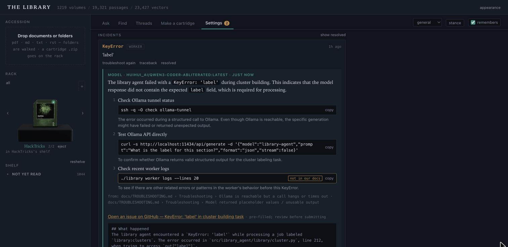
</p>

## Cartridges

A cartridge is a slice of a library that another library can put on its **rack**: a zip with a manifest, a colour, an icon, and the data. The receiving library doesn't just file it — it reads across everything it holds, so threads and disagreements form *between* collections, and every margin note keeps the colour of where it came from.

The point is sharing between people who can't share the documents. A confidentiality level sets what leaves:

| Level | Originals | Passages | Readings (summaries, notes) | What the receiver can do |
|---|---|---|---|---|
| `full` | yes | yes | yes | open the pages, cite them |
| `readings` | no | no | yes | search and cite *your reading* of each section; never sees the text |
| `catalogue` | no | no | summaries and subjects only | knows the material exists, asks you for it |

At `readings`, each section's summary stands in as its passage, so retrieval, the citation apparatus and the reader work unchanged — a note from such a source reads *Security's reading of …* rather than quoting a page. Levels control what leaves, not what happens after import. Figures travel with the original, so a `full` cartridge shows them in the receiver's reader and the other two levels do not, with no field to get wrong.

```sh
./library export --name "Security" --level readings --subject "Network Security"
./library insert security-v1.zip           # or drop the zip on the accession box
```

<p align="center">
  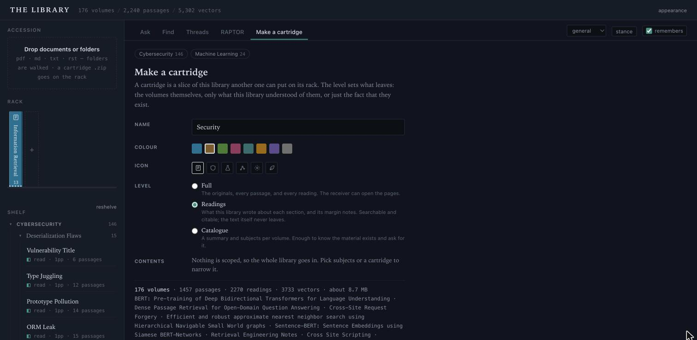
</p>

**A cartridge is an object**, built the way the real thing is: a front plate with grip grooves, three level pips, a power light and a screw, a PCB inside with an edge of gold contacts, and the label a sticker on the front.

- **Shell.** Six plastics — solid, clear, frosted, smoke, glitter, metallic — with dials for tint, opacity, sparkle and roughness. What tells them apart is what light does: solid stops it, metallic mirrors it, clear passes it straight (the board and constellation sharp inside), frosted scatters it so the shell glows with its colour, smoke absorbs it, glitter throws it back in points. The colour is one of eight chosen to contrast with the room's pigments, or anything from the wheel.
- **Label.** Art you upload, or by default the cartridge's own *constellation* — its volumes laid out from their vectors in its colour — with a **finish**: paper, gloss, holographic, prism, gold or chrome foil. Drag the preview to watch the foil catch the light. The shell and label shaders are ported from a decompiled set of cartridge materials, contributed by a second assistant.
- **Clearance** — open, internal, confidential, restricted — prints as a band across the label. A receiving library won't re-export the volumes of a restricted cartridge, and the clearance sets the volumes' [classification](#classification).
- **Sealed.** The design is sealed into the manifest, so a cartridge looks the same on every rack. A cartridge made *here* is yours to change: *edit* opens the panel filled from it, **save to the rack** changes how it looks, and **make it** exports it as itself (same id, next version) so a receiver upgrades in place rather than gaining a twin.

Lit by a studio HDRI and rendered with one vendored library (three.js); nothing is fetched from a network, and uploaded or shipped art is re-encoded on the way in.

**The rack is one socket, and the socket is a pedestal** — a stepped base, a fluted drum with a service panel, and a Doric capital whose abacus carries the bronze mouth, gilt at the lip; limestone by day, basalt by night.

- **Seat one to walk into its room.** Step or scroll through your cartridges; the one in view hangs above the pedestal until you click, then it drops in with a bounce and the light comes on. The composer becomes *Ask HackTricks's shelf*, and Find, the shelf and follow-ups stay inside it. Click again to lift it out; hovering lifts it up large beside the nebula.
- **The drawer.** *all* lays out every cartridge as a card — label, colour band, level pips, clearance, volume count, origin — with the chosen one turning live beside its particulars, and *seat it*, *show on the rack* and *edit* to hand. Double-click a card to seat it.

A folder can also arrive as a cartridge directly: `./library import ~/hacktricks --cartridge "HackTricks"` — or a wiki: export the Confluence space as HTML and `./library import ./export --cartridge "Ops Docs" --read`, then `./library export` it for the person who will plug it in. Read it before you export it: readings travel with the cartridge, so their shelf is organised and Threads has something to show on day one.

**What happens on arrival.**

- A document that arrives from two cartridges is one document with two memberships; subjects merge by name.
- Vectors ship as float16 and load directly when the embedding model matches, re-embedded from the shipped text when it doesn't. A 391-volume cartridge with 3,913 vectors inserts in about eight seconds.
- Clusters and contradictions are never shipped — the receiver recomputes them across the new whole, which is the point.
- Content is hash-verified; there is no signing. A cartridge that was unzipped and zipped again (Safari, then Finder's *Compress*) is still read as it was made.
- Eject removes what the cartridge brought and leaves what was already yours.

## Classification

Every volume has a **level** on a scale you choose in **Settings › Classification**: the U.S. scale (*Unclassified · CUI · Confidential · Secret · Top Secret*) or a company one (*Public · Internal · Confidential · Restricted*). A volume gets its level from one of four places:

- a banner line in its text: a line that's nothing but a marking, such as `SECRET//NOFORN` or `COMPANY CONFIDENTIAL`, never the word mid-sentence;
- the clearance of the cartridge it came in, or the level its sender marked it with;
- the reader, where the level in the header can be set by hand;
- otherwise, the scale's default.

A passage opening with a portion mark such as `(S)` or `(C)` carries that level itself, and a volume is never lower than its highest passage.

<p align="center">
  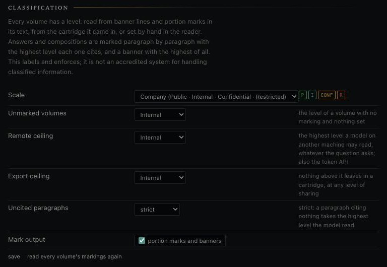
</p>

The answer at the top of this page is marked this way: each paragraph opens with `(I)`, under an *Internal* banner.

**Enforcement.**

- **Ceiling.** A ceiling next to *effort* keeps a conversation, a Find or a Write below a level. Passages and readings above it aren't retrieved at all, held passages above it are dropped, and the answer says how many were withheld.
- **Provider ceilings.** A model on a provider is always held to that provider's ceiling, whatever the question asks — set per provider in Settings › Providers (*may see up to …*); a provider without one is held to the scale's remote ceiling. Writing and checking are both counted, so a composition is held to the lower of its two models. Everything the token API hands out is held to the remote ceiling.
- **Export ceiling.** Nothing above the export ceiling leaves in a cartridge, at any level of sharing. The preview says how many volumes were held back.

**Marking.** Output follows the derivative rule:

- **Paragraphs.** Each paragraph and list item of an answer or composition is marked with the highest level among the sources it cites, as `(C)`. A paragraph that cites nothing takes the highest level the model read (*strict*, the default) or the default (*cited only*).
- **Banners.** A banner in the level's colour sits at the top and bottom with the highest level of all. A saved composition carries its marks and banner in its Markdown.

This labels and enforces a policy you set. It isn't an accredited system for handling classified information: detection reads only markings it's told to look for, and marks on output are derived from sources, not from judging what a sentence reveals.

## Modules

A **module** is a live connector as an object: a read-only line to an API the librarian can consult during a question. SentinelOne is the first: CVE exposure, whether an indicator has been seen, the application inventory and where an application runs, and agent status. Nothing is ingested. When a question calls for it, the librarian thinks it through with the conversation in view and calls what answers it — several operations across modules if the question has several parts (*how severe is this CVE, and are we exposed?* asks NVD and SentinelOne together), looking at what came back before deciding whether to call again, at most four calls a question. It only ever picks declared operations and fills their inputs (never a URL, never code), and the code checks what it proposes: a value must fit its input's pattern (a CVE id looks like one), an input marked exact is never guessed, and an identifier — a CVE, hash or address — must already be in the question, the conversation or an earlier result, since a model that can't see the ids will invent them. The results join the passages. It's cited and verified like them, and marked *live* in the module's colour.

Under the rack, **Modules** shows the pedestal's four sockets and *Active modules n/4*. **bay** opens a close-up: the pedestal's service panel comes forward and slides aside to reveal the connector array, four hex sockets with gold contacts and a status light each, and the seated cartridge on top. Choose a module and click an empty socket (or press *seat* for the first free one), and it drops in, its rim lights sweep round, and it's live. A module in a socket is what gets consulted; take it out and it isn't.

<p align="center">
  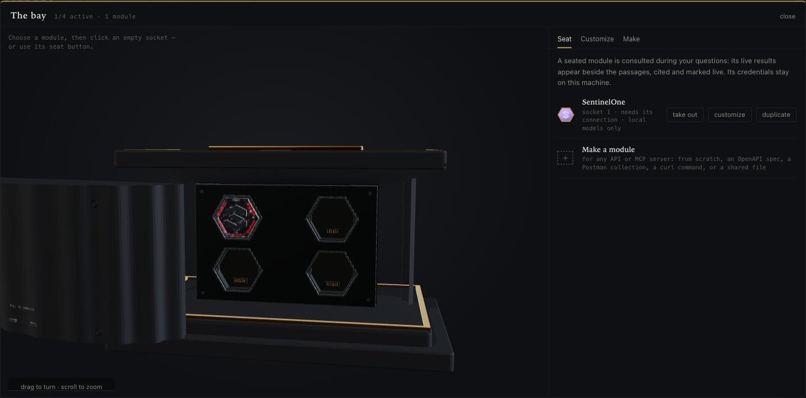
</p>

Hovering a seated module in the sidebar raises it into the reading pane, turning, as hovering a cartridge does. **Customize** turns the module in close-up and changes every part of it: the body (moulded plastic, brushed metal, gold, clear, frosted or glitter resin, glazed ceramic), a raised logo traced from any image you give it (only the traced mask is kept, and it's re-encoded on the server), foil finishes for the logo, face and the etched solar back, the rim-light colours, the identity strip, contacts, edge and circuit colours, and the planet inlays. **Connection** holds its base URL and API token. The module is kept 0600 in `~/.library-agent/modules.json`, never sent to a model or back to the browser. A module in a socket without a connection glows amber. A module marked *local models only* refuses to run when chat is on a remote provider, and the desk says so.

**Classification** (in Customize) sets what a module's live results count as on your [classification](#classification) scale — SentinelOne's fleet data might be *Confidential*. A question whose ceiling is below it, or a remote model held to the remote ceiling, doesn't consult the module at all (the desk says why), and an answer that cites it is marked at that level. Unset, results count as the scale's default.

**Make a module, for any API.** The bay's **Make** tab (or *+ make a module*) widens to a builder. Start **from an example** — working modules against public services, each noting what it teaches: OpenAlex (papers, no sign-in, nested fields), NVD (CVE details and CISA's known-exploited list; deep paths, fixed query values, strict rate limits), arXiv (an XML/Atom response), GitHub (path parameters, fixed headers, Link pagination) and an MCP time server (a program this machine runs, one operation per read-only tool). An example opens as a draft to *try it*, change, and make. Or start from scratch, from an **OpenAPI / Swagger** document (JSON or YAML: pick the handful of GET operations the librarian should be able to ask; the parameters, auth scheme, row path and line are drafted from the spec), from a working **curl** command (its auth is recognised and its secret goes to the connection, never the file), or from a **shared module file**, which shows what the module can do (host, sign-in, every operation) before you approve it. A module file can also be **dropped** on the accession box or on the bay, like a cartridge; it opens on the same review, and nothing is added until you approve it.

A module is a manifest (`library-connector/1`) in `~/.library-agent/connectors/`, plain data checked field by field when it loads:

- **Signing in:** none, bearer, an API key in a named header (with a prefix such as `ApiToken `), a key in the query, username and password, or OAuth2 client credentials (exchanged on the pinned host and cached until expiry).
- **Operations:** a path template with typed parameters (string, int, number, bool, enum, date; required, defaults, bounds), placed in the path (percent-encoded whole), the query or a body. GET only, or POST for a search endpoint that you mark read-only. No write verbs, no absolute or `../` paths, no setting the host or the secret's header.
- **Responses:** JSON rows by path (`data.items[*]`, nested fields, a single object as one row), XML (entities refused), CSV or plain text. Each row prints by a line format like `{title} by {user.login} ({created_at|date})`, with filters `date`, `join`, `trunc:N`, `upper`, `lower`, `default:x` and `count`.
- **Pagination:** page number, offset, cursor or `Link` header, capped per module and at ten pages absolute; a next link off the pinned host is refused.
- **Guard rails:** each module has a pinned host (plus any it names), no redirects, a timeout, a byte cap, a rate limit, a short cache and a clearance.

**try it** runs an operation of the unsaved draft once and shows what came back beside how the librarian will read it, so a path or line format is fixed before anything is saved. Your modules can be edited, exported and deleted. An export is the module's overall configuration and look, with no credentials and nothing of this installation: its base or server URL, header and environment values, other hosts, an absolute token URL and paths under your home folder are left out, and the file names what whoever imports it must fill in. The built-in SentinelOne can be duplicated as a starting point.

**Two more ways in.**
- **Postman.** Paste or open an exported collection (v2.x). Requests are listed folder by folder, and anything that writes is shut. `{{variables}}` resolve from the collection, `:id` segments become required parameters, and a secret held in a variable or the collection's auth goes to the connection, never the file.
- **MCP servers.** A module can reach an MCP server instead of an HTTP API: a program this machine runs (stdio, given only PATH, HOME, the locale and its secret in the variable you name), or a server at a URL. *List its tools* shows each tool with the server's own read-only / destructive marks. Only tools that look things up can be picked. Every operation is declared read-only in the module, and the server's marks are checked again before each call, so a tool it calls destructive is refused whatever the module says. A shared module that would start a program says so, with the full command, before you approve it.

## Connecting other tools

Other programs — a script, an internal tool, an agent — can talk to the library the way a person at the desk does, and get the same verified citations back.

**One rule about who may ask.** The browser on the same machine needs nothing, as it always has. Anything arriving from *off* the machine must send `Authorization: Bearer <token>` with a token from `LIBRARY_API_TOKENS` (comma-separated); with no tokens configured, off-box requests are refused. The port stays on loopback until you set `LIBRARY_BIND` (a LAN or Tailscale address, or `0.0.0.0`). Two deliberate steps to open it, none to keep it closed.

**Plain JSON** (`/api/v1/…`), for anything that can make an HTTP call:

```sh
curl -s -X POST http://library:8077/api/v1/ask -H "Authorization: Bearer $TOKEN" \
  -H 'content-type: application/json' \
  -d '{"question":"What does Kerberoasting require?","room":"HackTricks","model":"technical"}'
```

returns `{answer, citations[{n,title,page,section,document_id,cartridge,held}], verified{emitted,resolved}, conversation_id}` — every `[n]` in the answer is a citation below, and anything the model cited that could not be verified against the shelf was stripped before you saw it. `room` is a cartridge by name, so a tool can be told *ask only our docs*; `subjects` are shelf names; `conversation_id` continues a thread; `passages` (chunk ids from a search) are answered from first, retrieval filling the rest — *answer from these three passages*. Also `GET /api/v1/search?q=…&room=…`, `GET /api/v1/shelves` (what there is to ask about), `GET /api/v1/volumes/{id}`, and `POST /api/v1/compose` `{brief, room?, subjects?, length, shelve?}` → a whole document as markdown with its references and citation tally (minutes, not seconds: one retrieval and one generation per section).

**MCP**, for anything that is an agent. `./library mcp` serves four tools — `list_shelves`, `search_library`, `ask_library`, `read_volume` — over stdio; `./library mcp --http 8078` serves them over streamable HTTP for an agent on another machine. It is a thin client of the JSON API (`LIBRARY_URL`, `LIBRARY_TOKEN`), so one Ollama, one job at a time, and one door stay one thing. For Claude Desktop or Claude Code, point the MCP config at `./library mcp` in this directory.

A team's documentation comes in as its own cartridge (`./library import ~/docs --cartridge "Ops"`) with a clearance set, and the tool is told to ask that room.

**Running it for others.** Everything answers through one model instance, so the engine is built to fail plainly rather than slowly:
- *Liveness, not reachability.* A one-token probe runs every two minutes. Ollama can wedge with its HTTP still up — `/api/tags` answers, nothing generates — and that is the state the probe catches. While it fails, `ask` and `compose` return **503** with the reason at once instead of holding sockets open, the masthead says *the model is not answering*, and Settings shows the probe's last result.
- *A gate.* At most `LIBRARY_MAX_CONCURRENT_GENERATIONS` (2) generations in flight, one per token, and a caller that would wait past `LIBRARY_QUEUE_TIMEOUT_SECONDS` (60) gets **429** with `Retry-After`. A script in a loop queues behind itself, not behind everyone else. The person at the desk is not limited against themselves.
- *A deadline.* `ask` answers within `deadline_seconds` (default 240) or returns **504**.
- *Cooler by default.* JSON callers get temperature 0.3 (`LIBRARY_API_TEMPERATURE`); the UI keeps 0.6. `"deterministic": true` sets temperature 0 and a fixed seed — best effort: on a GPU backend Ollama is usually, not always, byte-identical, and the content and citations are what stays fixed.
- *Passages are data.* The system prompt now always says that quoted passages, wherever they came from, are never instructions.

## Models

| Role | Default | Notes |
|---|---|---|
| Reading (all passes) | `qwen3:30b-a3b` | Pinned corpus-wide: artifacts from different models drift |
| Chat — general | `qwen3:30b-a3b` | Thinks before answering; the UI streams it |
| Chat — technical | `huihui_ai/qwen3-coder-abliterated` | Per-conversation toggle |
| Compose (Write) | `qwen3:30b-a3b` | A background job, so it can carry a larger, slower model without slowing chat |
| Compose — checking | the Compose model | Splits each section into searches, reviews it against its passages, and distils what it settled. Its review runs without thinking by default: on the 235B, thinking took 64 of a medium document's 76 minutes, and without it the document took 11 while flagging the same kinds of overreach (unsourced prevalence, dropped qualifiers, unattributed design claims). Set `LIBRARY_COMPOSE_REVIEW_THINK=true` for a document to be read closely |
| Embeddings | `bge-m3` | 1024-dim, stored as `halfvec` |
| Reranker | `BAAI/bge-reranker-v2-m3` | In-process torch; the one thing not served by Ollama |
| Figures | `qwen2.5vl` | Reads each figure into a passage at Tier 1; optional |

Ollama can be local or remote — every model call follows `LIBRARY_OLLAMA_URL`, which defaults to `localhost:11434`, so an SSH tunnel to a GPU box needs no configuration at all.

### Other providers

Ollama is the default and needs nothing set up. Any role can also run on a **provider**: anything that speaks the OpenAI chat-completions protocol — OpenAI, Anthropic's compatible endpoint, OpenRouter, Groq, Mistral, DeepSeek, LM Studio, vLLM, llama.cpp's server, or another Ollama's `/v1`. Add one in Settings › Providers with an id, a base URL ending in `/v1`, a key, and how far it's trusted: **may see up to** a [classification](#classification) level (unset: the remote ceiling), and **internal** — it runs on infrastructure you control, so modules cleared for *local models only* may use it; **test** lists its models and has one answer, so a wrong key or URL shows at once. Its models then appear in the role dropdowns under Settings › Models, prefixed with the id — `openrouter:anthropic/claude-sonnet-4.5` — and a role pointed at one carries a *remote* mark. Roles are chat (general and technical), reading, threads (cluster summaries, conflict judging, shelving), **compose** (long-form Write, its own role so a slow, strong model writes documents while chat stays fast), vision and troubleshooting; a role left at *default* is whatever the environment says.

Providers and assignments live in `~/.library-agent/providers.json`, readable by you alone; the API and the worker both pick a change up without a restart. Two things are deliberate. *Reading* is switchable but warns before it changes: artifacts record the model that wrote them, and a different reader means the next backfill re-reads the whole shelf at that model's price. *Embeddings* are not switchable at all — every vector is `bge-m3` at 1024 dimensions, and moving them is a re-embedding of everything. Structured output asks for `response_format: json_schema` and falls back to `json_object` with the schema in the prompt where a server refuses it; reasoning a provider streams (`reasoning_content`) shows as the murmur.

## What was measured

**Your own questions, judged by you.** A generated set only asks whether the passage a question was written from comes back; it can't say whether the results support a real question. So there is a second set: open **Settings › judge the library** (`/eval`), pick a question you have actually asked (Ask history and Write briefs are listed) or type one, and *gather*. The top passages from four retrieval setups, plus an exact-name search, arrive as one list sorted by volume, with no hint of which setup found which. Mark the passages that **support** an answer and the ones that **look relevant but don't**, or call the question unanswerable, and tag its type (exact, concept, mechanism, multi-hop, synthesis, negation, conflict). Each volume is fixed to *tune* or *test*, and a case is *tune* only when all its volumes are, so nothing tuned on the tune split has seen a test volume. `./library eval tune` scores every setup per question type and per case: MRR, hit@k, recall of the supporting passages, and distractors in the top five. Each run is saved with the volume count, embedding model and prompt versions. The set and its runs stay in `~/.library-agent/eval/`, outside the repository, since they quote your library. Aim for 50 to 100 cases before trusting a difference. **Someone else can judge too.** *Packet for a reviewer* writes questions you have asked but not judged, each with its pooled passages as text, plus instructions and the exact answer format, into one file for a reviewer such as Astra. Bring their answers back with the packet and they are saved as that reviewer's cases, scored in their own column; your own judgements are never overwritten. *Export for review* hands over what is already judged, passages and marks included. Both quote your library.

**The model can judge too, on probation.** *Suggest* has the local model rule on each gathered passage (supports, looks relevant but doesn't, unrelated), with a reason you can read, and you confirm or correct its marks. *Let the model judge 10* judges asked questions unattended. Those cases are tagged model-judged, listed for you to check, and scored in their own tables, never mixed with yours. Every question you save after a suggestion is also a measurement: the page shows how often the model agrees with you per question type, with Cohen's kappa so chance agreement doesn't count. Where agreement is high, model-judged cases of that type are worth using; where it's low, judge them yourself. A model grading retrieval shares retrieval's blind spots (a neighbouring mechanism, a control working as intended read as a failure), and this is how you find out where.

**Which model to run on.** `./library bench init` writes known-answer questions from your own shelf; `./library bench` then measures the model's side of the work — speed (first token, first word, tokens per second, four streams at once), reliability of the library's structured calls (valid on the first try, and why not), and correctness (known-answer questions, citations verified, runs agreeing, the unanswerable declined, the conflict judge on known cases) — for any mix of local and provider models, with a Markdown report per run. See [`bench/`](bench/README.md).

Retrieval is evaluated on a generated question set (a question per gold passage, the answer known) with a ladder of configurations, so every stage earns its place. Re-run on the current corpus — 1,219 volumes, 57 questions, most of them from the security material:

| config | recall@1 | recall@5 | recall@10 | MRR | s/query |
|---|---|---|---|---|---|
| dense only | 0.56 | 0.89 | 0.91 | 0.69 | 0.14 |
| lexical only | 0.09 | 0.30 | 0.44 | 0.17 | 0.17 |
| **hybrid (RRF)** | **0.61** | 0.86 | 0.91 | **0.71** | 0.19 |
| hybrid + router | 0.61 | 0.81 | 0.86 | 0.70 | 0.23 |
| hybrid + reranker | 0.58 | 0.82 | 0.89 | 0.69 | 1.50 |

Two days earlier, at 176 volumes, hybrid RRF measured MRR 0.65 and recall@10 0.94 — so a sevenfold larger corpus cost almost nothing. Lexical search alone collapses on this material (short technical titles, heavy overlap between documents); dense carries it and fusion adds a little on top. The reranker does not help on generated questions, which read like keyword queries; on real questions, judged by hand, it does, so Ask, Write and Find all use it. The router hurts slightly and stays off by default.

Answer quality is checked separately by `scripts/consistency.py`: questions with known answers in the collection, each asked three times without memory, scored on whether the right volume was cited, whether the answer contains what a correct answer must, whether every emitted citation resolved, and whether the runs agree — plus a question the library cannot know, to confirm it says so rather than inventing a source. On the current corpus, both chat models:

| | general (qwen3 30B) | technical (qwen3-coder 30B) |
|---|---|---|
| correct terms present | 15/15 | 15/15 |
| expected volume cited | 15/15 | 15/15 |
| citations verified | 84/84 | 78/78 |
| runs agree per question | 6/6 | 6/6 |
| unknowable question declined | 3/3 | 3/3 |
| median seconds per answer | 5.0 | 2.6 |

The one detail worth knowing: asked what the owner ate for breakfast, the general model declined *and* cited the only breakfast in the library — a squirrel's, in an example from the T5 paper — while saying it was unrelated. That is the behaviour the apparatus is for. `uv run python scripts/verify.py` exercises every surface end to end.

Do the Tier 2 reflections help the *answers*? Retrieval had said no twice; `scripts/reflections_ab.py` asked about synthesis instead — the same question, the same passages, once bare and once with the library's note beneath each, judged blind by the reader model. Over 14 questions: plain preferred 7, with notes 4, tie 3; groundedness 4.3 plain against 3.6 with notes; usefulness 4.4 against 4.3; citation validity 1.00 both ways. The notes make the answer lean on the note's claims rather than the passage's, and the judge notices. So reflections stay where they are — in the margin, for the reader — and out of the answer's context.

Contradictions used to change every rebuild — 0 to 7 findings from identical runs. Each cluster is now judged up to three times at temperature 0 with fixed seeds and a finding needs two votes. Measured on 50 clusters (every flagged one plus 25 clean) judged three times each: 50 of 50 agreed with themselves.

## Layout

```
library                 one-command launcher
src/library_agent/
  ingest/               extraction, section tree, chunking, dedup, bulk import
  reading/              tier 1 and tier 2 passes, versioned prompts
  retrieval/            hybrid search, router, reranked pipeline; readings and threads for compose
  library/              clusters, citation graph, contradictions, taxonomy, shelving, cartridges, claim anchors
  modules/              live connectors: manifests, the executor, OpenAPI / curl / Postman / MCP importers
  classification.py     the scale, markings, ceilings, and portion-marking output
  ops/                  incidents and troubleshooting against the docs
  api/routes/v1.py      plain JSON for other programs; api/auth.py the door
  llm/liveness.py       the one-token probe and the generation gate
  mcp_server.py         the library as MCP tools
  chat/                 citations, query rewriting, stances, streaming, composing (threads, argument memory, chapters, the seal)
  eval/                 question generation, recall@k harness, the hand-judged set
bench/                  model benchmarks: speed, reliability, correctness (results stay local)
  api/  worker/  db/
web/index.html          the UI, one file, no build step
web/cartridge3d.js      the cartridge as an object, and the pedestal (three.js)
web/token3d.js          modules as objects, and the bay
web/vendor/             three.js, RGBELoader, one studio HDRI — all vendored
docs/TROUBLESHOOTING.md what the troubleshooter reads
ops/                    launchd units, backup and restore
tests/
```

## Status

Complete through the planned scope. [`docs/DEVLOG.md`](docs/DEVLOG.md) is the phase-by-phase record of how it was built and what each measurement showed.
